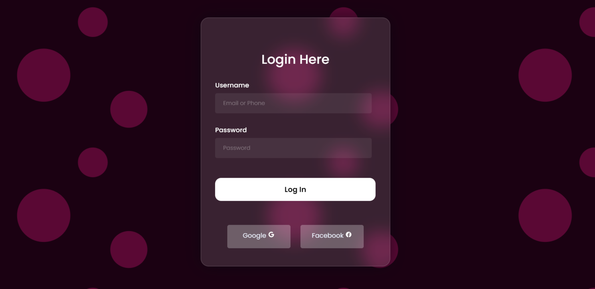

<h1 align="center"> Interface de Login </h1>

  

  

## 📜 Resumo
Este repositório contem um exemplo de uma Interface de Login para um site web feito em html e css.

## 🚀 Tecnologias

Esse projeto foi desenvolvido com as seguintes tecnologias:

- HTML
- CSS
- Git e Github

## 📝 Licença

Esse projeto está sob a licença MIT.
